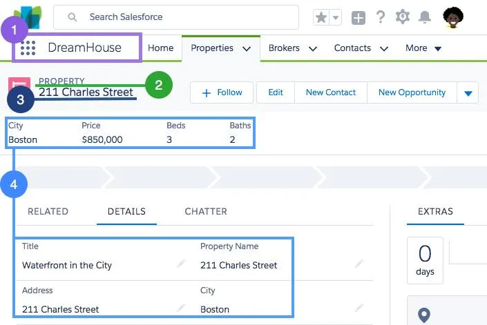
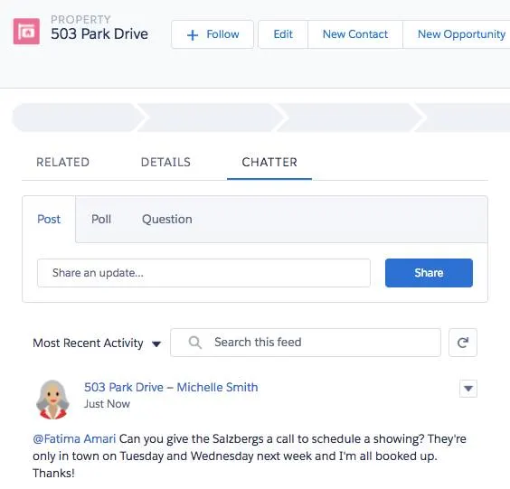

# Omair's Salesforce Notes
## Salesforce Platform Basics
* Reference: [Salesforce Platform Basics (Trailhead Module)](https://trailhead.salesforce.com/content/learn/modules/starting_force_com) - *Note: this is not part of the required training, but is referenced in the [Get Started with Platform Development unit](https://trailhead.salesforce.com/content/learn/modules/platform_dev_basics/platform_dev_basics_intro?trail_id=force_com_dev_beginner&trailmix_creator_id=omairinam&trailmix_slug=salesforce-app-exchange-training)*
### Terms
1. **App**: set of objects, fields, and other functionality that supports a business process
2. **Objects**: tables in the Salesforce database that store a particular kind of information
   * standard and custom objects
3. **Records**: rows in object database tables
4. **Fields**: columns in object database tables. 

### Use-cases
#### High Impact, Low Effort
* Custom objects enable Chatter feeds on specific object records, allowing comms around that object to be centralized. 
